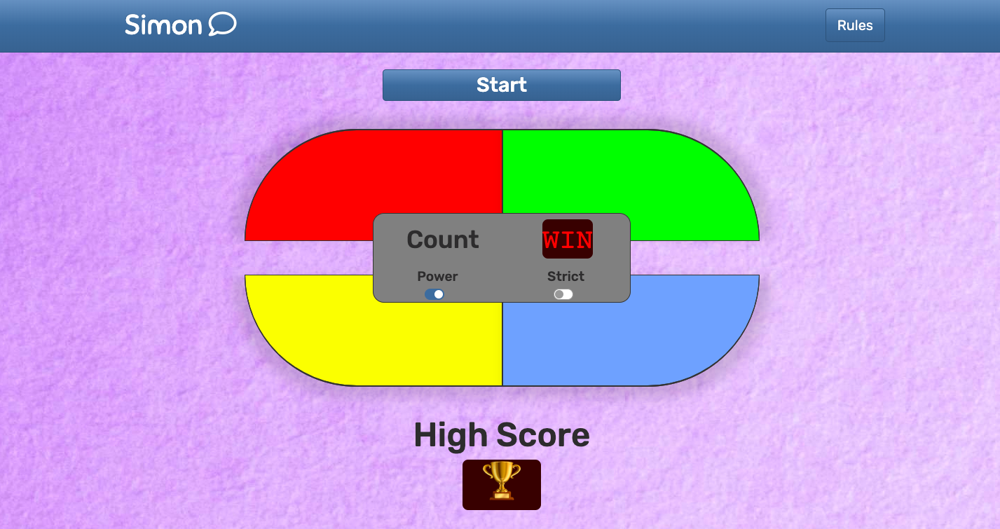

<p align="center">
    <h1>MileStone Project 2 - Interactive Front-End Development</h1>
</p>
<p align="center">
    <strong>Check Out the Game Here: <a href="https://github.com/Hermeticpoet/milestone-project-2">Simon Game</a></strong>
</p>

# Simon Game

## The Brief
> CREATE A MEMORY GAME
>
> Build a simple single-player memory game inspired by Simon. Check out this short [video](https://www.youtube.com/watch?v=1Yqj76Q4jJ4) 
and [Wikipedia](https://en.wikipedia.org/wiki/Simon_(game)) entry to understand the rules of the game. Provide details in your README.md 
of the logic you have used to build your game as well as an explanation of how you tested your logic.
>

<p align="center">
    Game As Rendered In Opera<br /><br />
    
</p>

## UX
### Project Goals
The goal of the project is to provide a simple memory game that anybody can play, young or old with little to no development experience.
The game should be fun and easy but also allow for a more difficult version, in order to test the more advanced memory game players. Users 
should be able to understand the layout and controls intuitively so as to best accomodate for ease of game play.

At the top of the screen, within the navbar, is a *Rules* button. Clicking on this will either dropdown an accordian on mobile view or pop-up
a modal on all larger screen sizes. These rules will explain the aim of the game to the user. The game itself will be disabled upon user's arrival 
to the page, to prevent any errors. The center of the game board will contain the controls for powering the game on and, should the user decide to, 
pick to play the game in *strict mode*.

Once the game is powered on, a sound will play to notify the player and the display screen on the control panel will greet them *"HI"*. At this
point the start button at the top of the screen will become active and allow the player to begin the game. The *Top Score* display will then change
to show the player what the last, best high score achieved was for the game, by default, if the game has not been played by the user on the current
browser (localStorage is empty), then the display will show *"00"*. Until such time as the player presses the *Start* button, the game boards colour 
buttons will still be disabled until after the javascript engine has generated the first sequence and the corresponding coloured button lights 
up and plays a sound to notify the player of the first sequence. This too will prevent players from pressing buttons before the game begins and
causing possible errors.

#### Modal & Accordian
According to [uxmag](https://uxmag.com/articles/modals-on-mobile-how-to-use-them-wisely "Modals") and [uxmovement](https://uxmovement.com/mobile/why-you-should-avoid-using-modal-windows-on-mobile/ "Mobile Modals"), modals are best
used on screens of tablet size and bigger. Therefore, I have chosen to include an accordian for the __Rules__ on mobile devices, while keeping the
more standard modal pop-up on the larger device screens.

#### Conceptual Design
During the Scope Plane phase of my design, I used Balsamiq to create my [wireframes](https://github.com/Hermeticpoet/milestone-project-2/tree/master/assets/wireframes).
These have been added to the file tree and pushed to my [GitHub](https://github.com/Hermeticpoet/milestone-project-2) repo for viewing.

#### Colours
The colour choices used for the layout of the page were taken as part of the [Bootswatch Spacelab](https://bootswatch.com/spacelab/) theme. I wanted 
my game to mirror that of the original in essence so I chose to go with the four standard colours of Red, Green, Blue and Yellow. The background colour
was chosen to lighten the look and feel of the application, by adding contrast to the darker buttons while also complimenting the navbar and footer
colours provided as part of the Bootswatch theme.

#### Fonts
The primary font Rubik was selected for its soft, playful aesthetic. Likewise, the secondary font Sniglet maintains this same playful look but with a 
slightly harder, straighter lined edge to make the button text clear to the users. The displays use the more traditional Courier font as it provided
the most clear and plain format within the display box with its seeming led glowing appearance.

### User Stories
As a player, I want: 
1. To find and understand the rules of the game easily. 
2. To intuitively grasps where everything on the page and around the game board.
3. Audio and visual feedback when I play the game so that I know when I have clicked or not clicked something.
4. The capability to increase the difficulty of the game when I choose.
5. Visual feedback as to what level of the game I am on and what the current best score for the game has been.
6. To be given some form of alerted recognition when / if I complete the game.

As a developer, I want:
1. To have ease of access to the code underlying the application.
2. To have clear guidelines and instructions available through the README.md file.
3. To see well commented and indented code to allow for quick and easy reading of that code.
4. To be presented with a well structured file tree that makes finding the files simple too.
5. Additionally, to have a properly formatted README file that allows for quick navigation within the file itself.

## Features
The main focus of the project was to meet the requirements of the brief while also delivering a product that would meet the needs of its possible future users. 
Therefore, I considered the user stories carefully when building the features and components for the game. As such, the primary features consisted of:
* Making the overall layout of the game resemble the original physical Simon game.
* Employing some form of notification features to alert players of various markers within the game.
* A responsive navigation bar that provides a __Rules__ button.
* A game icon placed in the standard top left corner of navigation bar.
* A footer with personalised copyright details and year of creation.
* A large Start button above the game board for beginning the game.
* The Strict switch control on the game board to allow for increasing difficulty level.
* Display Screens:
  * Display 1 -> The current player level is displayed on the game board controls. 
  * Display 2 -> The top score is displayed at the botom of the page below the game board.
* Different coloured buttons the light up and have a sound effect attached to them.
* Pop-up or dropdown modal and accordian rules for players to understand their requirements.

### Existing Features
When a user arrives at the game page for the first time, the game itself will be disabled by default, except of course the **Rules** button in the navbar.
This will always be functioning and accessible. There is a __**power**__ switch on the game board controls panel to turn the game on. Once this has been
clicked, the game will play a sound to notify the player that the game is now on, while the control display will greet them. The disabled attribute will
also be removed from the start button to allow functionality.

The top score display screen below the game board will show any data retrieved from localStorage that contains any previous high scores. If this is the 
first time the user has arrived at the game then it will display "00" by default. The game buttons (coloured divs) will still be disabled to prevent users
from pressing them and causing any errors. 

There is an initial conditional check placed on the power switch to make sure the game was _off_ before the switch was toggled. If the game was off, then all
of the above features kick into play. However, if the game was already _on_, then the game now resets itself, the display screens go blank and all the
buttons are once again disabled:

<p align="center">
    ```javascript
    $("#powerOn").click(function() {
        if (onBtn.checked == true) {
            playPowerOnSound();
            $("#count").text("HI");
            setTimeout(clearTurnCount, 1200);
            $('.startBtn').removeAttr('disabled');
            topScoreDisplay = getTopScoreFromLocalStorage();
            $("#topScoreCount").text(topScoreDisplay);
        } else {
            resetGame();
            $(".startBtn").attr("disabled", "disabled");
            addDisable();
          }
     });
    ```
</p>
Once the game is powered on and the player clicks the start button, _Simon_ will automatically generate a random number between 1 and 4. This number
is then matched to one of the _ID's_ of the 4 coloured buttons, all of which are numbered 1-4: 
<p align="center">
    ```javascript
    function genSimonSeq() {
     addDisable();
     $("#count").text(level);
     if (!error) {
      getRandomNum();
     }
     let i = 0;
     let myInterval = setInterval(function () {
      id = simonSeq[i];
      color = $("#"+id).attr("class").split(" ")[2]; 
      addClassSound(id, color);
      i++;
      if (i == simonSeq.length) {
       clearInterval(myInterval);
      }
     }, 1000);
     setTimeout(removeDisable, 2000);
    }
    ```
</p>
The pushing of this number to the matching _ID_ of the corresponding coloured button then calls a function to change the background colour of that 
button (the button then appears to light up) and plays an electronic button press sound that was retrieved from the [Soundjay.com](https://www.soundjay.com/) website:
<p align="center">
    ```javascript
    function addClassSound(id, color) {
        $("#"+id).addClass(color + "-light");       
        playBtnSound();         
        setTimeout(function() {
            $("#"+id).removeClass(color + "-light");
        }, 500);        
    }
    ```
</p>
When the game has finished generating its sequence and the buttons have lit up and played the sound, the coloured buttons then become activated, in order
to allow the player to repeat the sequence. The code used to create the player sequence array is similar to that of the game generated Simon sequence. It
will also play the button press sound as the user clicks the corresponding button and cause it to light up too. 

After a player has attempted to repeat the Simon sequence, a function will be called to check the players generated array againsed that of the game generated
array. If they are a match but the game is not complete, then Simon will move up one level by replaying the previous sequence with another colour added on.
If the player gets a move wrong, the game will play an error sound and the level display will quickly show **"NO"** before returning to the correct level, repeating
the sequence that the player got wrong and the game continues: 
<p align="center">
    ```javascript
    if (checkUserSeq()) {
      if (userSeq.length == simonSeq.length && userSeq.length < total_GAME_LEVELS) {
       level++;
       userSeq = [];
       error = false;
       setTopScore();
       genSimonSeq();
      }
      else if (userSeq.length == simonSeq.length && userSeq.length == total_GAME_LEVELS) {
       playGameWinSound();
       displayWin();
       lightUpBoard();
       removeBtnLights();
       setTopScore();
       resetGame();
      }
     }
    
     else if (!checkUserSeq()) {
      if (strictBtn.checked == true) {
       strictMessage();
       playErrorSound();
       resetGame();
      }
      else {
       displayError();
       error = true;
       setTimeout(genSimonSeq, 1000);
      }
     }
    }
    
    
    // Check User Seq with Simon Seq ***********************************************
    
    function checkUserSeq() {
     for (var i = 0; i < userSeq.length; i++) {
      if (userSeq[i] != simonSeq[i]) {
       return false;
      }
     }
     return true;
    }
    
    
    // Display Error Function ******************************************************
    
    function displayError() {
     playErrorSound();
     let counter = 0;
     let myError = setInterval(function () {
      $("#count").text("NO");
      counter++;
      if (counter == 3) {
       $("#count").text(level);
       clearInterval(myError);
       userSeq = [];
       counter = 0;
      }
     }, 300);
    }
```
</p>
The game will also check when a player sequence is incorrect if the strict mode has been enabled. If this is the case then the game error sound will play
and the player will see the Top Score display show a frustrated emoji as the game is now over. No mistakes are allowed in strict mode:
<p align="center">
    
</p>
Alternatively, if the player manages to get to the end of the game by repeating the full 20 levels, a game winning sound will play, the board will light up
in a circular sequential pattern -- Red, Green, Blue and then Yellow, before each one sequentially going back out again. The control panel level display
screen will show **"WIN"** and the top score display will present the player with a _Trophy_:
<p align="center">
    
</p>
As the user plays through the game and the levels increase, the game will check to see if at any point the level has moved higher than any previous high
scores. If this is the case, then the **Top Score** display will change to highlight the new higher level of achievement and save this to localStorage:
<p align="center">
    ```javascript
        function setTopScore() {
         checkTopScore();
         $("#topScoreCount").text(topScoreDisplay);
         setTopScoreToLocalStorage();
        }
    ```
</p>
If a player has lost the game, playing under strict mode or they have reached the end by winning the game, they can reset the game by clicking the start
button and this will reset all the sequences back to empty arrays and begin the game again:
<p align="center">
        ```javascript
        function resetGame() {
         userSeq = [];
         simonSeq = [];
         level = 0;
         strict = false;
         error = false;
         $("#count").text(" ");
         if (onBtn.checked == true) {
           $("#topScoreCount").text(topScoreDisplay);
         } else {
           $("#topScoreCount").text(" ");
         }
        }
    ```
</p>

#### Features Left to Implement
The original Simon Game uses different sounds (piano keys) for each of the coloured buttons. I specifically chose not to to do this so as to remove that added
hint to the players. I recognised that this will impede the ability of some hard of sight users to play the game in its current state. Therefore, it would be 
prudent to create the different sounds for each of the buttons and possibly have a short automated demo to play each sound while its corresponding coloured
button lights up at the beginning of each game in order to show those users where each button is that plays that particular sound.

There is also the issue of the top score in localStorage. If a player gets to the end of the game and wins, this will obviously be set to 20 and will stay that 
way indefinitely as that score cannot be beaten without changing the underlying code. I would also consider that for younger players, children in particular, 
it might be annoying if they cannot reach the top score of an older player who has played the game on their device. These users may not know how to clear the
browser storage in order to reset the Top Score. Thus, it may be a good idea to add in a button for the basic user to clear the top score from storage.

## Technologies Used
##### HTML - semantic structure & layout of the site
+ **[HTML5](https://en.wikipedia.org/wiki/HTML5)**

##### CSS - styling & game aesthetics
+ **[CSS3](https://en.wikipedia.org/wiki/Cascading_Style_Sheets#CSS_3)**

##### Javascript - logic & game functionality
+ **[Javascript](https://en.wikipedia.org/wiki/JavaScript)**

##### jQuery - to simplfy DOM manipulation
+ **[jQuery](https://jquery.com/)**

##### Bootstrap - framework to speed up development & simplify responsiveness
+ **[Bootswatch](https://bootswatch.com/spacelab/)**

##### Jasmine - to allow for testing of code & for agile development
+ **[Jasmine](https://jasmine.github.io/)**

##### Google Chrome - ease of use & rapid tesing of code on the fly
+ **[Chrome Dev Tools](https://developers.google.com/web/tools/chrome-devtools/)**

### Testing
In this section, you need to convince the assessor that you have conducted enough testing to legitimately believe that the site works well. Essentially, in this part you will want to go over all of your user stories from the UX section and ensure that they all work as intended, with the project providing an easy and straightforward way for the users to achieve their goals.

Whenever it is feasible, prefer to automate your tests, and if you've done so, provide a brief explanation of your approach, link to the test file(s) and explain how to run them.

For any scenarios that have not been automated, test the user stories manually and provide as much detail as is relevant. A particularly useful form for describing your testing process is via scenarios, such as:

#### Contact form:
Go to the "Contact Us" page
Try to submit the empty form and verify that an error message about the required fields appears
Try to submit the form with an invalid email address and verify that a relevant error message appears
Try to submit the form with all inputs valid and verify that a success message appears.
In addition, you should mention in this section how your project looks and works on different browsers and screen sizes.

You should also mention in this section any interesting bugs or problems you discovered during your testing, even if you haven't addressed them yet.

If this section grows too long, you may want to split it off into a separate file and link to it from here.

## Deployment
This section should describe the process you went through to deploy the project to a hosting platform (e.g. GitHub Pages or Heroku).

In particular, you should provide all details of the differences between the deployed version and the development version, if any, including:

Different values for environment variables (Heroku Config Vars)?
Different configuration files?
Separate git branch?
In addition, if it is not obvious, you should also describe how to run your code locally.

## Credits

### Content
The sound clips were taken from [Soundjay.com](https://www.soundjay.com/button-sounds-1.html "Game Sounds"). A free to use site of various sound files.
The Trophy emoji was taken from [emojipedia.org](https://emojipedia.org/trophy/ "Emoji Trophy Image"). These are also free to use.
### Media
The photos used in this site were obtained from ...
### Acknowledgements
I received inspiration for this project from watching a number of videos & tutorials from various You Tube users that inspired my ideas for this project. 
Two in particular were - [George Louis](https://www.youtube.com/watch?v=iXscqYgZ7HQ "Root Code") & [Beau Carnes](https://www.youtube.com/watch?v=zwKoo7VDj44 "Edureka"). 
The Bootstrap Switch was garnered from GitHub user [graingert](<link href=”css/bootstrap-switch/bootstrap-switch.css” rel=”stylesheet”>)...

__Simon__ is a registered trademark of **Hasbro**.