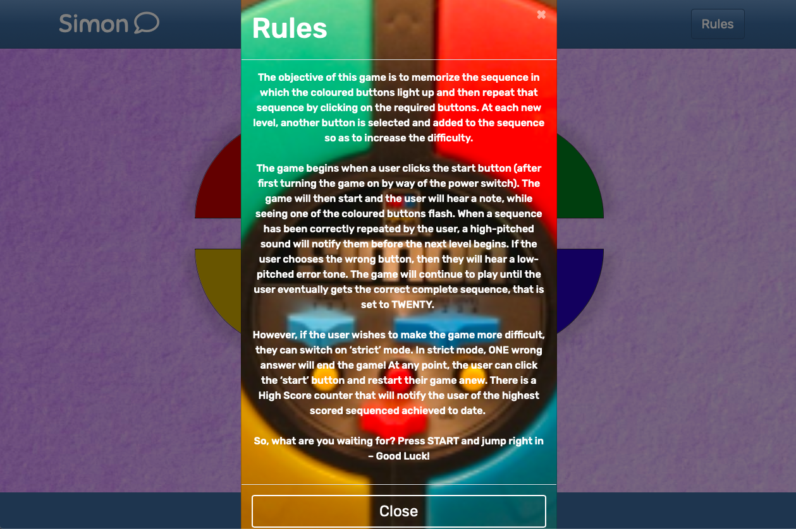
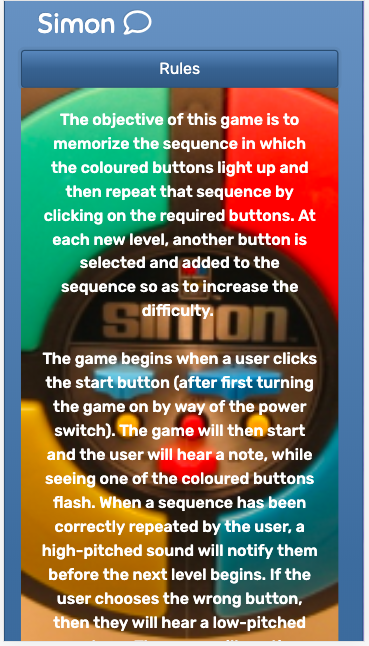
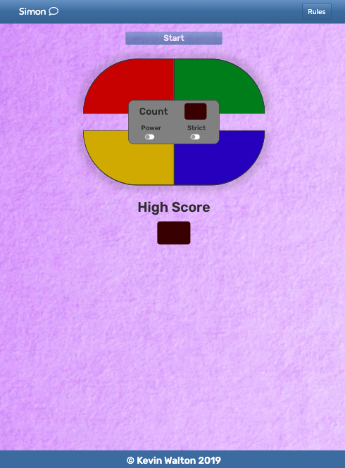
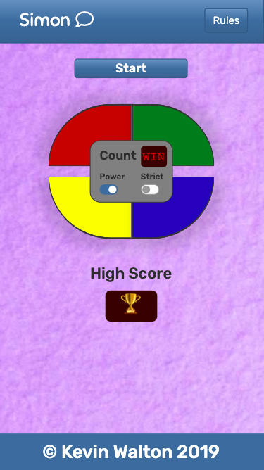

<p align="center">
    <h1>Simon Game - Test Results</h1>
</p>

## Manual Testing
The tests carried out during this phase were standard across all browsers and devices. 
* Rendering of the layout with the correct style.
* Rules button accordian working on mobile & modal for larger devices.
* All buttons disabled on first load up.
* Game board sound plays when powered on, display says "HI" and start button is enabled.
* Start button begins game; button lights up, noise sounds and first level is displayed.
* Colour buttons are now enabled, player can press them and they light up and play sound.
* Game correctly matches player sequence to simon sequence or catches an error.
  * If its an error then error sound plays, display says "NO" and simon repeats previous.
  * If player sequence correct then level goes up and simon carries on.
  * If player sequence correct and end of game then board lights up and plays winning sound.


<p align="center">
    Modal Displayed on Safari Browser
</p>
<p align="center">
    
</p>

____

<p align="center">
   Accordian Displayed on iPhone  
</p>
<p align="center">
    
</p>

____

<p align="center">
    Strict Mode Error Screen
</p>
<p align="center">
    
</p>

____

<p align="center">
    iPad Pro Positioning Issue
</p>
<p align="center">
    
</p>

____

<p align="center">
    Pixel 2 Phone Winning Screen
</p>
<p align="center">
    
</p>

____

### Bugs Detected
1. Initially, after my first few commits, I checked the rendering of the app across all the main browsers. It worked perfectly on Chrome, Mozilla and Opera but
had an issue with margin spacing between the **Top Score** display and the footer on Safari and Edge. 
  1 After much commenting out of code and using the **developer** settings available in Safari, I realized that the bootstrap utility classes that I was using 
    for my margins was causing an issue. I resolved this by removing the utility classes and increasing the margins between the two elements in my CSS styles.

2. There was an early problem of the buttons being active when the game sequence was playing out. This caused error in the game and made it unpleasant to play.
  2 I asked some questions on Slack about this issue but none of the direct replies worked for my app. I therefore went back to Stack Overflow and found a 
    solution in this [post](https://stackoverflow.com/questions/13831601/disabling-and-enabling-a-html-input-button). I then adapted this to create my own loop
    that would resolve the colour buttons being pressable during simon sequence:

```javascript
function addDisable() {
 colorBtns.forEach(function (button) {
  button.classList.add("btn-disabled");
 });
}
```

3. When the game was near complete, for example, the game could be played perfectly well till the winning end point, I discovered a bug with the **Strict Mode**.
    If a user made an error under while this mode was switched on the game should have ended. However, in my app, the error would show but then simon would
    repeat its sequence and game could continue.
  3 When examing what was happening "under the hood" through the use of **Dev Tools**, I also noticed that the game was going into an infinite loop when a player
    made an error under strict mode conditions. The solution to this came after much heartache and ardous console logging, while also move around entire blocks of
    code to test it. I discussed this with my mentor Chris who advised me to continue shifting the code blocks in my conditional statements around one block at a
    time till I could see where the bug arose. I eventually found that order of my conditional statements was causing the error. I therefore moved these around and
    the code worked without any errors or bugs:

```javascript
else if (!checkUserSeq()) {
  if (strictBtn.checked == true) {
   strictMessage();
   playErrorSound();
   resetGame();
  }
```

#### Bugs Still Outstanding
There is a slight positioning issue when game is rendered on the iPad Pro in **Dev** **Tools**. There is a lot of empty digital real estate between the bottom of
the **Top** **Score** display and the footer. I played around with the margins here but could get no relief. I did come to realize that the issue was with my use
of the sticky footer that keeps it pushed down at the bottom of page no matter the size of other elements. This was an integral part of my code that made the
rendering of the page consistent across all other browsers and platforms. Therefore, given that the game still looks good on the iPad Pro and it maintains its
full functionality, this slightest of bugs has not required me to alter my code, in order to accomodate for it.

#### Code Refactoring
I feel looking at my code that a bit more refactoring is possible, in order to reduce the verbosity of some code blocks. For instance, my choice to have the game
board light up sequentially in a circular motion, one button at a time; Red, Green, Blue, Yellow, and then have them go back out in that same order has been written
in what I think is verbose code:

```javascript
function lightUpBoard() {
 setTimeout(redBtn, 1000);
 setTimeout(greenBtn, 1500);
 setTimeout(blueBtn, 2000);
 setTimeout(yellowBtn, 2500);
}
```
```javascript
function removeBtnLights() {
 setTimeout(redBtnRemove, 3000);
 setTimeout(greenBtnRemove, 3500);
 setTimeout(blueBtnRemove, 4000);
 setTimeout(yellowBtnRemove, 4500);
}
```

The timeout functions within the add and remove button light functions above also call other smaller functions to do their work:

```javascript
function redBtn() {
 $(".red").addClass("red-light");
}

function redBtnRemove() {
 $(".red").removeClass("red-light");
}
```

I believe there could be some form of iterative loop that could condense this code down in a smaller code block and after multiple
attempts to do so and asking for assistance on Stack Overflow [here](https://stackoverflow.com/questions/55514399/how-to-append-to-one-specific-class-amongst-multiple-class-in-an-element). I eventually decided against
pursuing it any further. My own research and attempts lead me to believe it would take some form of recursive loop to achieve what I 
wanted here and unless these are built very carefully by an experienced developer, I could well run into another issue of infinite loops.

## Automated Testing
### Jasmine
The Jasmine tests were carried out after the game was completed. The reason for this is that I was completely new to JavaScript and Jasmine at the start of 
the project. Therefore, I did not feel capable or comfortable writing Jasmine tests at the same time that I was trying to figure out and write my Javascript. 
And as such, I chose instead to test my code manually while getting to grips with JavaScript and then tackle learning Jasmine afterwards.

Jasmine-Jquery CDN has been imported into the jasmine testing to allow for jQuery within the JavaScript functions.

My approach to using Jasmine was to test each function a small section at a time and slowly build up to more complex expectations. Some of my test results
can be seen below:


### Validation Services
[W3C Markup Validation](https://validator.w3.org/nu/) was used to validate HTML.
  - The validator read the opening body tag in 'error' until I commented out the audio files in the head section then all passed.

[W3C CSS validation](https://jigsaw.w3.org/css-validator/) was used to validate CSS.
  - The root variables are read as a 'parse error' by the validator but otherwise everything passed.

[JSHint](https://jshint.com/) was used to validate JavaScript.
  - Again, it does not like the $ from jQuery but otherwise everything passed.

## Further Testing
In conjunction with viewing my app on all devices available in Chrome Dev Tools. I also ran it on Safari, Opera, Mozilla and Edge. The app rendered properly
across all the browsers and devices while maintaining full functionality. My friends and family were also called in to test the game's cross platform
performability, this included; 

* [iPhones 9 & 10](https://www.apple.com/ie/iphone/)
* [Galaxy Samsung S7 & S10](https://www.samsung.com/ie/smartphones/)
* [Hauwei P30](https://consumer.huawei.com/en/)
* [Macbook Pro](https://www.apple.com/ie/mac/)
* [Dell laptop](https://www.dell.com/en-ie/shop/laptops/sc/laptops)
* [Apple iPad Air](https://www.apple.com/ie/ipad/)
* [Google Chromebook](https://www.google.com/chromebook/)

